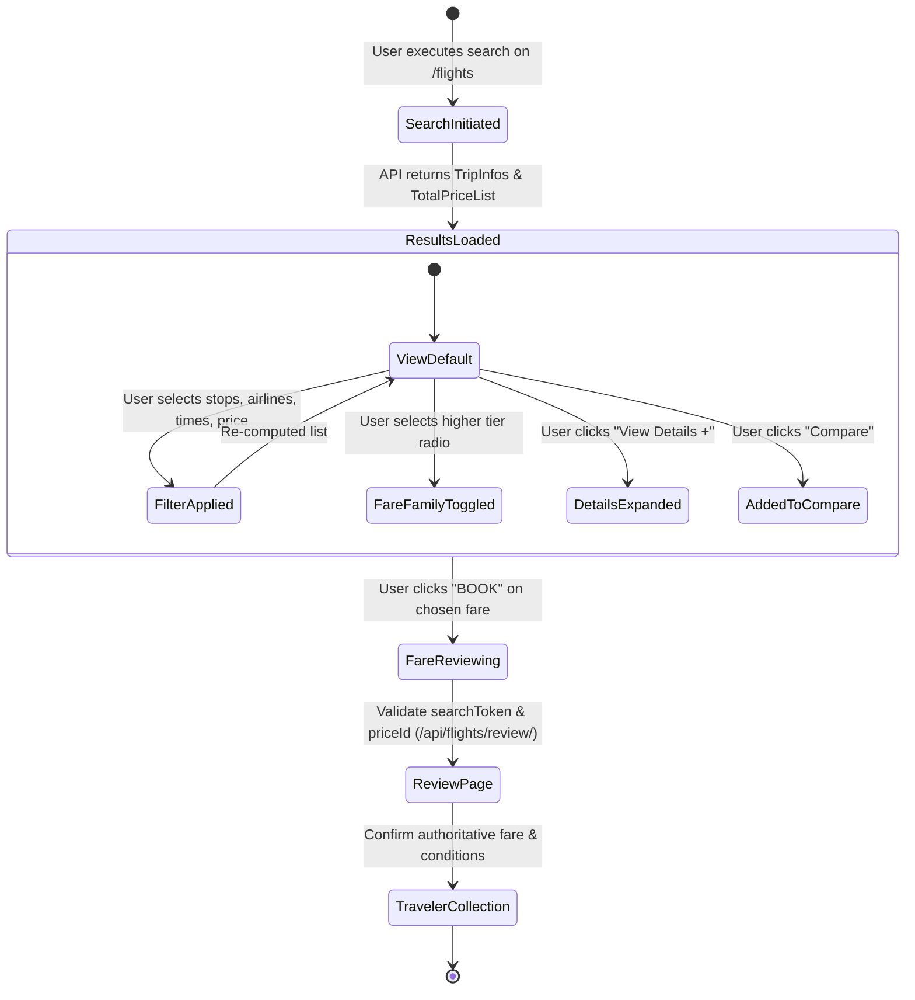

# B2B Flight Search & Booking UI Workflow Analysis
**Source Reference**: TripJack Authenticated Agent Portal (Flight Search & Results Screen)  
**Project**: Goimomi (`goimomibackend` & `goimomifrontend`)  
**Date**: October 2026

---

## 1. Executive Summary & Purpose

The uploaded screenshots capture the authenticated B2B Flight Search Results & Booking Interface (standard TripJack Agent Portal). This workflow is engineered for high-density, real-time comparison across multiple airlines, fare classes, schedule brackets, and fare families (Upfront, Published, SME/Corporate, NDC). 

The primary objective of this UI is to allow travel agents or high-volume bookers to:
1. Instantly scan flight routes, schedules, and duration.
2. Evaluate and toggle between multiple fare families on the exact same flight segment without leaving the card.
3. Rapidly isolate options using 11+ orthogonal filter facets (timeframes, price range, baggage types, specific flight numbers, terminals, alliances, airlines with starting fares and counts).
4. Benchmark prices across adjacent calendar dates using a dynamic fare calendar strip.
5. Proceed directly to checkout (`BOOK`) or launch a multi-flight side-by-side comparison (`Compare`).

---

## 2. Layout Structure & Component Hierarchy

```
+---------------------------------------------------------------------------------------------------+
| 1. Top Navigation & Search Summary Bar                                                            |
|    [Origin (MAA)] -> [Destination (DXB)] | [Date] | [Pax & Class] | [Pref. Airline] | [MODIFY]    |
+---------------------------------------------------------------------------------------------------+
| 2. Date Carousel / Multi-Day Fare Calendar Strip (< [Date 1] [Date 2] ... >) [Share: WA, Email]   |
+------------------------------------+--------------------------------------------------------------+
| 3. Left Filter Rail (Sidebar)      | 4. Main Results Viewport                                     |
|    - Price Range (Dual Slider)     |    - Highlight Cards: [Cheapest] | [Fastest]                 |
|    - Incentive / Net toggles       |    - Sorting Bar: Duration | Departure | Arrival | Price     |
|    - Popular Quick Filters         |    - View Mode: [Tap To Combined View]                       |
|    - Stops (0, 1, 2, 3+)           |    -----------------------------------------------------     |
|    - Departure Time Slots (Matrix) |    - Flight Result Cards:                                    |
|    - Arrival Time Slots (Matrix)   |      * Airline Logo, Code, Route, Timings, Duration           |
|    - Baggage (CheckIn / Hand-only) |      * Badges: Handbaggage, Overnight (+1 Day), Seats Left    |
|    - Fare Type (Standard, NDC, etc)|      * Tiered Fare Options (Radio selection per row):        |
|    - Flight Number Input Filter    |        [Upfront / Published / Corporate] [Price] [Perks]     |
|    - Airline List with Fares/Counts|      * CTAs: [ BOOK ] (Primary) | [ Compare v ]              |
|    - Cancellation Type             |      * Accordion: "View Details +"                           |
|    - Alliance & Terminal Selectors |                                                              |
+------------------------------------+--------------------------------------------------------------+
```

---

## 3. Detailed UI Workflow Breakdown

### A. Top Search Summary & Modification Header
* **Route Summary**: Displays origin airport code, city, country (`MAA - Chennai, India`) and destination (`DXB - Dubai, United...`) with connecting flight icon.
* **Metadata Pills**: Displays Departure Date (`Sat, Oct 3rd 2026`), Passengers & Cabin Class (`1 Adults | ECONOMY`), and Preferred Airline (`None`).
* **Modify Search CTA**: Outlined dropdown button (`MODIFY SEARCH v`) that expands an inline or modal search form without losing context.
* **Agent Profile**: User avatar / agency balance indicator on the far right.

### B. Multi-Day Fare Calendar Strip
* **7-Day Rolling Viewport**: Displays adjacent travel dates with pagination arrows (`<` and `>`).
* **Dynamic Fare Fetching**: Shows "Fetch Fare" (or real-time lowest price once loaded) for each day, encouraging date flexibility.
* **Quick Share Bar**: Social / collaboration shortcuts (WhatsApp, Email, Copy Link/Print) to share quotes directly with travelers.

### C. Quick Highlight Banner (Benchmark Cards)
Positioned directly above the flight cards to provide immediate decision anchoring:
1. **Cheapest**:
   * Icon & Color: Orange badge.
   * Key Metric: `₹12,607.50` | Duration: `11h 10m`.
2. **Fastest**:
   * Icon & Color: Lightning bolt icon.
   * Key Metric: `₹19,846.50` | Duration: `4h 5m`.

### D. Results Controls & View Toggle
* **Sort By Pills**: Instant sorting toggles for `Duration` (active), `Departure`, `Arrival`, and `Price`.
* **View Switcher (`Tap To Combined View`)**: Allows switching between standard list view and split-screen combined roundtrip view.

---

## 4. Left Sidebar Filter Engine (11 Facets Analyzed)

Based on the uploaded screenshots (Images 1 through 5), the filter rail provides comprehensive search refinement:

| # | Filter Facet | UI Control Type | Behavior & Parameters |
|---|---|---|---|
| **1** | **Price Range** | Dual-thumb slider + Min/Max numeric inputs + "Apply" button | Adjusts flight visibility between absolute min (`₹12,607`) and max (`₹2,91,284`). |
| **2** | **B2B Agent Toggles** | Checkboxes | `Show Incv` (Show Incentive) & `Show Net` (Show Net B2B fare) & `Hide Nearby Airports`. |
| **3** | **Popular Filters** | Chip / Pill buttons | Quick toggles: `Non Stop`, `1 Stop`, `Departure: 12-18`, `Departure: 18-00`. |
| **4** | **Stops Selector** | 4-way segmented buttons | `0`, `1`, `2`, `3+`. |
| **5** | **Departure Timeframe** | 4-quadrant icon buttons + custom time picker | Time quadrants: `00-06` (Dawn), `06-12` (Morning), `12-18` (Afternoon), `18-24` (Night). Includes button `Select Specific Timeframe 🕒`. |
| **6** | **Arrival Timeframe** | 4-quadrant icon buttons + custom time picker | Same quadrant structure for arrival airport (`Arrival From Dubai`). |
| **7** | **Baggage Type** | Checkboxes | `Show CheckIn Baggage` vs `Show Hand Baggage Only`. |
| **8** | **Fare Type (with Counts)**| Checkboxes with live counts | `Standard (171)`, `NDC (45)`, `Corporate / SME (16)`, `Business (6)`. |
| **9** | **Flight Number Search**| Text Input + Add button (`+`) + `CLEAR` link | Explicit search input: `Eg. 123 Or 6E-123` to filter exact aircraft legs. |
| **10**| **Airlines Directory** | Live search box + Checkbox list with counts & min price | Real-time search by airline name. Each item displays: `[x] Airline Name`, count of flights, and starting fare (e.g. `IndiGo 10 - ₹12,607.50`, `Gulf Air 4 - ₹16,494.50`, `Emirates 1 - ₹19,846.50`). Includes red `CLEAR` button. |
| **11**| **Cancellation Type** | Checkboxes | `Non Refundable` vs `Refundable`. |
| **12**| **Alliance** | Checkboxes | `One World`, `Star Alliance`, `SkyTeam`. |
| **13**| **Terminal Filter** | Airport group tab + Checkboxes | Categorized by `DEPARTURE` -> Airport `MAA` -> `Terminal 1`, `Terminal 2`, `Terminal 4`. |

---

## 5. Flight Result Card Architecture & Fare Matrix

The flight card is designed around **Fare Families (Multi-Price Tiers)** per flight schedule:

### Flight Header & Segment Block
* **Airline Details**: Logo, Name (`IndiGo`), and flight segment numbers (`6E-948, 6E-1461`).
* **Schedule & Track**:
  * Origin Departure: `MAA 14:30 Oct 03`
  * Intermediate Track: `1 Stop(s)` with arrow pointing to total elapsed time `11h 10m`.
  * Destination Arrival: `DXB 00:10 Oct 04`
* **Urgency & Condition Alerts**:
  * Red Alert: `Handbaggage Fare`
  * Overnight Notice: `Flight Arrives after 1 Day(s)`
  * Scarcity/Inventory: `Seats left: 2` (in red emphasis)
* **Details Accordion**: `View Details +` expands flight itinerary, layover details, baggage policy, and fare rules.

### Tiered Fare Options (Fare Family Rows)
Instead of forcing the user into a separate modal, the card renders multiple fare products directly:
* **Option 1**: Selected Radio (`🔘`) | `₹12,607.50` (with edit/markup pen icon) | Tag: `Upfront` | Perks: `Economy, Free Meal, Refundable`
* **Option 2**: Radio (`⚪`) | `₹14,672.50` | Tag: `Published` | Perks: `Economy, Free Meal, Refundable`
* **Option 3**: Radio (`⚪`) | `₹20,758.50` | Tag: `Published` | Perks: `Economy, Free Meal, Refundable`
* **Option 4**: Radio (`⚪`) | `₹20,975.50` | Tag: `Published` | Perks: `Economy, Free Meal, Refundable`
* **Expandable Overflow**: `+4 more fares ∨` to reveal SME, Flex, NDC, and Business fare tiers.

### Card CTAs (Right Rail)
* **Primary CTA (`BOOK`)**: High-contrast solid orange button initiates the booking/review pipeline for the currently selected fare radio.
* **Secondary CTA (`Compare ∨`)**: Dropdown button allows adding this flight to the side-by-side comparison drawer.

---

## 6. End-to-End User Journey / State Flow



---

## 7. Goimomi Implementation Roadmap & Gaps

Comparing this workflow with the current implementation in `FlightResults.jsx` and `Flights.css`:

| Feature Area | Current Goimomi Implementation | Enhancement to Match Portal |
|---|---|---|
| **Fare Multi-Tier Display** | Renders lowest fare or single selected fare | Render tiered fare radio list inside each card (`Upfront`, `Published`, `Corporate`) with `+X more fares` dropdown. |
| **Agent Pricing Tools** | Customer-facing total price | Support agent markup icon, `Show Net`, and `Show Incentive` (for staff/agent mode). |
| **Flight Number Search** | Filter by text in JS filter state | Dedicated flight number chip box with `+` and `CLEAR` actions. |
| **Timeframe Picker** | 4 icon buttons | Add "Select Specific Timeframe" sub-modal/slider for precise hour selection. |
| **Terminal Filtering** | Basic terminal list | Segmented Departure/Arrival terminal checkboxes grouped by airport code. |
| **Urgency Indicators** | Basic stop/duration badges | Add `Seats left: N` badge and `Flight Arrives after 1 Day(s)` indicator. |
| **Fare Calendar Strip** | Date slider with shiftDate | Dynamic "Fetch Fare" / minimum price indicator for 7-day window. |
