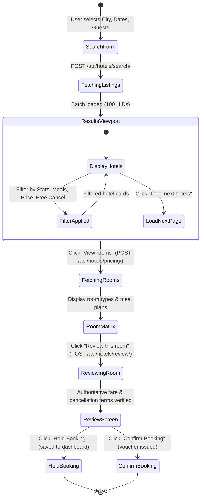

# B2B Hotel Search & Booking UI Workflow Analysis
**Source Reference**: TripJack Authenticated Agent Portal (Hotel Search, Listing & Room Booking Flow)  
**Project**: Goimomi (`goimomibackend` & `goimomifrontend`)  
**Date**: October 2026

---

## 1. Executive Summary & Purpose

The TripJack B2B Hotel Engine provides multi-supplier hotel inventory, dynamic room rates, meal plan variants, and verified cancellation policies for travel agents. 

The primary objectives of this workflow are:
1. **Targeted Discovery**: Search by city/region, landmark, or specific hotel property with flexible check-in/out and multi-room passenger occupancy.
2. **High-Efficiency Comparison**: Filter properties across star ratings, price range, meal inclusions (Room Only, Breakfast, Half Board), and free cancellation deadlines.
3. **Room Family & Meal Plan Matrix**: Display multiple room types (Standard, Deluxe, Suite) with individual rate options and meal plan variants on a single property view.
4. **Authoritative Cancellation Timelines**: Render cancellation penalties and refund cutoff windows explicitly in Indian Standard Time (IST).
5. **Two-Stage Checkout**: Support instant confirmation as well as temporary hold with inventory lock.

---

## 2. Layout Structure & Component Hierarchy

```
+---------------------------------------------------------------------------------------------------+
| 1. Top Search & Filter Bar                                                                        |
|    [City / Hotel] | [Check-in -> Check-out] | [Rooms & Guests] | [Nationality] | [MODIFY SEARCH]   |
+------------------------------------+--------------------------------------------------------------+
| 2. Left Filter Rail (Sidebar)      | 3. Main Hotel Results Viewport                               |
|    - Price Range (Min/Max Slider)  |    - Destination Title & Total Properties Found              |
|    - Star Category (5, 4, 3, 2, 1) |    - Quick Sort Bar (Price: Low to High, Rating, Popularity) |
|    - Meal Basis (EP, CP, MAP, AP)  |    --------------------------------------------------------- |
|    - Free Cancellation Only        |    - Hotel Result Cards:                                     |
|    - Property Type (Hotel, Resort) |      * Image Gallery / Hero Thumbnail with Star Rating       |
|    - Amenities (Wi-Fi, Pool, Spa)  |      * Hotel Name, Address, Proximity to Landmarks           |
|    - Popular Chains / Brands       |      * Badges: "Breakfast Included", "Free Cancellation"     |
|                                    |      * Starting Room Type & Key Inclusions                   |
|                                    |      * Starting Price (Per Night / Total + Taxes)            |
|                                    |      * CTA: [ VIEW ROOMS ] (Primary)                         |
+------------------------------------+--------------------------------------------------------------+
| 4. Hotel Detail & Room Selection View (Expanded / Modal)                                          |
|    - Property Gallery & High-Res Viewer                                                           |
|    - Hotel Overview, Check-in / Check-out Times, Property Policies                                |
|    - Room Matrix Table:                                                                           |
|      * Room Name & Bedding (King / Twin) | Room Size (sq ft)                                      |
|      * Inclusions: Meals (CP/MAP), Wi-Fi, Welcome Drink                                           |
|      * Cancellation Policy & Deadlines (IST)                                                      |
|      * Price Breakdown (Base + Taxes + Fees)                                                      |
|      * Action: [ BOOK NOW ] / [ HOLD ]                                                            |
+---------------------------------------------------------------------------------------------------+
| 5. Review & Checkout Screen                                                                       |
|    - Lead Guest & Passenger Details (Title, First/Last Name, Phone, Email)                        |
|    - Compliance: PAN Card (Domestic/High-Value) / Passport & Visa (International)                 |
|    - Special Requests & Bed Preference (Non-smoking, High Floor, Early Check-in)                   |
|    - Price Summary: Base Fare, Taxes, Service Fee / Markup, Total Payable                         |
|    - Payment / Credit Balance Debit / On-Hold Confirmation                                        |
+---------------------------------------------------------------------------------------------------+
```

---

## 3. Detailed UI Workflow Breakdown

### A. Search & Parameters Bar
* **Destination Autocomplete**: Real-time debounce lookup against TripJack `city-regionIds` or hotel names with highlighted matches.
* **Date Range Picker**: Minimum 1-night stay restriction, auto-advancing check-out date, relative day labels (`Tomorrow`, `Sat, 10 Oct`).
* **Multi-Room & Guest Selector**:
  * Configurable 1 to 9 rooms.
  * Per room: Adults (1–4), Children (0–2), Child Ages (1–12 years).
* **Nationality & Residence**:
  * Required nationality dropdown for accurate international / domestic hotel supplier tariffs.

### B. Results Engine & Filter Facets
* **Star Category**: Segmented checkboxes for 5★, 4★, 3★, 2★, and Boutique/Unrated.
* **Meal Basis**:
  * `EP` (European Plan - Room Only)
  * `CP` (Continental Plan - Breakfast Included)
  * `MAP` (Modified American Plan - Breakfast + Lunch/Dinner)
  * `AP` (American Plan - All Meals)
* **Cancellation Filter**: Quick toggle for "Free Cancellation Available".
* **Price Range Slider**: Min/Max bounds dynamically calculated from supplier batch.
* **Property Type**: Hotel, Resort, Apartment, Villa, Homestay.

### C. Hotel Result Card Architecture
* **Visual Presentation**: High-quality exterior/room photo with thumbnail gallery.
* **Rating & Stars**: TripJack Star classification badge with rating count.
* **Locality & Distance**: Full address with interactive map pin link.
* **Inclusion Highlights**: Green badge for `Free Breakfast`, `Free Cancellation until [Date]`.
* **Pricing Column**:
  * Shows total price for all rooms and nights (inclusive of basic taxes).
  * Management fee and tax rendered transparently.
  * High-contrast CTA button: **VIEW ROOMS** (deep-links to room option matrix).

### D. Room Selection Matrix (Hotel Detail Page)
* Grouped by Room Category (e.g. Deluxe Room, Executive Suite, Sea View Villa).
* Options for each room type displaying:
  * Meal Plan variant (Room Only vs Breakfast vs All Meals).
  * Cancellation Timeline:
    * Green: Free cancellation before `[Date] [Time] IST`.
    * Orange/Red: Non-refundable or penalty slab `₹[Amount] deducted after [Date]`.
  * Special Policies / Booking Notes: Child bedding rules, gala dinner charges, check-in ID requirements.
  * Direct action: **BOOK NOW** or **HOLD**.

### E. Review & Passenger Information
* **Authoritative Rate Validation**: Re-calls TripJack `/hotel/review` with `token` and `optionId` to lock inventory.
* **Traveler Collection**:
  * Salutation (`Mr`, `Mrs`, `Ms`), First Name, Last Name.
  * Contact Mobile Number & Email ID.
  * GST Details (Optional for B2B input tax credit): Company Name, GSTIN, Address.
  * International Bookings: Passport Number, Expiry, Nationality.
* **Booking State Actions**:
  * **Hold Booking**: Locks room reservation for up to 24 hours without immediate payment (subject to supplier hold eligibility).
  * **Confirm & Pay**: Deducts agent balance / initiates payment gateway for instant voucher generation.

---

## 4. End-to-End Hotel State Flow



---

## 5. Implementation Status in Goimomi

| Component / Workflow | Status | TripJack Compatibility |
|---|---|---|
| **City Autocomplete** | ✅ Complete | Cached local catalogue + TripJack `fetch-city-regionIds` |
| **Search Panel & Pax Modal** | ✅ Complete | 1–9 rooms, adults, child ages, nationality |
| **Hotel List & Cards** | ✅ Complete | Star ratings, photos, address, pricing column, responsive layout |
| **Filter Engine** | ✅ Complete | Star category, meal basis, price slider, property type, free cancellation |
| **Room Option Matrix** | ✅ Complete | Dynamic pricing, inclusions, price breakdown, cancellation slabs |
| **Review & Price Lock** | ✅ Complete | 15-minute signed token context, fare review verification |
| **Lead Guest & Hold/Book** | ✅ Complete | Primary guest form, Hold & Confirm bookings dashboards |
| **TripJack Live API Key** | ⏳ Pending | Awaiting API key from TripJack portal credentials |
